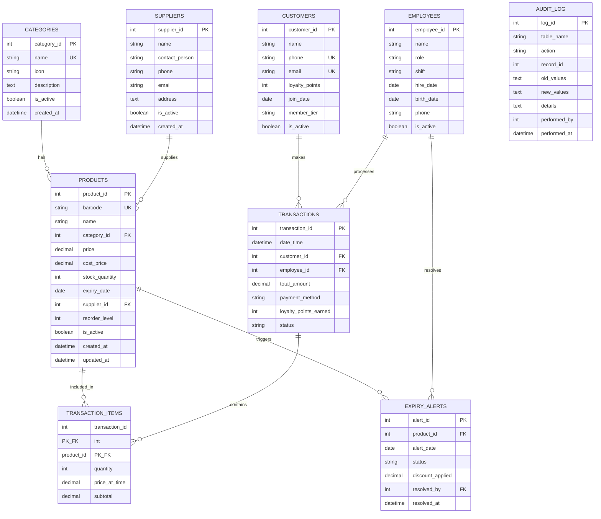

# Smart Mart ERP & E-commerce System

## Entity-Relationship Diagram (ERD)

### Relationship Summary

| Relationship | Cardinality | Description |
|---|---|---|
| CATEGORIES → PRODUCTS | 1:N | One category has many products |
| SUPPLIERS → PRODUCTS | 1:N | One supplier supplies many products |
| CUSTOMERS → TRANSACTIONS | 1:N | One customer makes many transactions |
| EMPLOYEES → TRANSACTIONS | 1:N | One employee processes many transactions |
| TRANSACTIONS → TRANSACTION_ITEMS | 1:N | One transaction contains many line items |
| PRODUCTS → TRANSACTION_ITEMS | 1:N | One product appears in many line items |
| PRODUCTS → EXPIRY_ALERTS | 1:N | One product can have many expiry alerts |

### Mermaid ERD

### Design Notes

- **9 tables** in Third Normal Form (3NF)
- **TRANSACTION_ITEMS** is a junction/bridge table resolving the M:N relationship between TRANSACTIONS and PRODUCTS
- **AUDIT_LOG** is a standalone event-sourcing table (no FK constraints to allow logging deleted records)
- **Composite Primary Key** on TRANSACTION_ITEMS (transaction_id, product_id)
- All tables use `AUTOINCREMENT` surrogate keys except the junction table
- Referential integrity enforced via `ON DELETE CASCADE`, `SET NULL`, and `RESTRICT`
