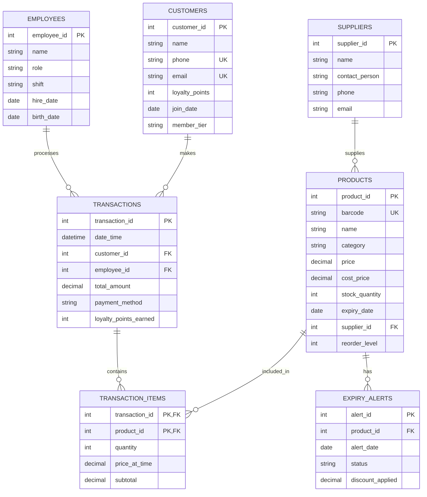

# Smart Mart

## Entity-Relationship Diagram

```mermaid
erDiagram
    SUPPLIERS ||--o{ PRODUCTS : supplies
    PRODUCTS ||--o{ TRANSACTION_ITEMS : included_in
    PRODUCTS ||--o{ EXPIRY_ALERTS : has
    TRANSACTIONS ||--o{ TRANSACTION_ITEMS : contains
    CUSTOMERS ||--o{ TRANSACTIONS : makes
    EMPLOYEES ||--o{ TRANSACTIONS : processes

    SUPPLIERS {
        int supplier_id PK
        string name
        string contact_person
        string phone
        string email
    }

    PRODUCTS {
        int product_id PK
        string barcode UK
        string name
        string category
        decimal price
        decimal cost_price
        int stock_quantity
        date expiry_date
        int supplier_id FK
        int reorder_level
    }

    CUSTOMERS {
        int customer_id PK
        string name
        string phone UK
        string email UK
        int loyalty_points
        date join_date
        string member_tier
    }

    EMPLOYEES {
        int employee_id PK
        string name
        string role
        string shift
        date hire_date
        date birth_date
    }

    TRANSACTIONS {
        int transaction_id PK
        datetime date_time
        int customer_id FK
        int employee_id FK
        decimal total_amount
        string payment_method
        int loyalty_points_earned
    }

    TRANSACTION_ITEMS {
        int transaction_id PK, FK
        int product_id PK, FK
        int quantity
        decimal price_at_time
        decimal subtotal
    }

    EXPIRY_ALERTS {
        int alert_id PK
        int product_id FK
        date alert_date
        string status
        decimal discount_applied
    }
```
